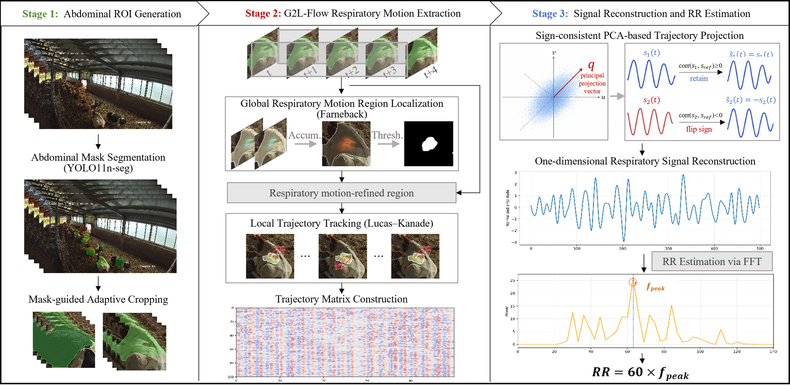

# Beef-Cattle-RR-Estimation

A real-world multi-view beef cattle respiration monitoring dataset for abdominal ROI segmentation and non-contact respiratory rate estimation under practical farm surveillance conditions.

## 🔥 Overview



## 1️⃣ Data

To find the dataset used in this study, please make sure all files are downloaded from [here](https://pan.baidu.com/s/14IGZI-iiqpn0GOc5NhI9Hg).  
Extraction code: please email at [bsdai@neau.edu.cn](mailto:bsdai@neau.edu.cn).

### 📁 Dataset Structure

```text
Beef-Cattle-RR-Estimation/
├── images/
│   ├── train/
│   │   ├── 001_D02_20240801002449_start00507_len60_000001.jpg
│   │   ├── 001_D02_20240801002449_start00507_len60_000002.jpg
│   │   └── ...
│   ├── val/
│   │   ├── 018_D02_20240801002449_start00663_len60_000001.jpg
│   │   ├── 018_D02_20240801002449_start00663_len60_000002.jpg
│   │   └── ...
│   └── test/
│       ├── 015_D08_20240903091705_start02246_len60_000001.jpg
│       ├── 015_D08_20240903091705_start02246_len60_000002.jpg
│       └── ...
├── labels/
│   ├── train/
│   │   ├── 001_D02_20240801002449_start00507_len60_000001.txt
│   │   ├── 001_D02_20240801002449_start00507_len60_000002.txt
│   │   └── ...
│   ├── val/
│   │   ├── 018_D02_20240801002449_start00663_len60_000001.txt
│   │   ├── 018_D02_20240801002449_start00663_len60_000002.txt
│   │   └── ...
│   └── test/
│       ├── 015_D08_20240903091705_start02246_len60_000001.txt
│       ├── 015_D08_20240903091705_start02246_len60_000002.txt
│       └── ...
└── abdomen_yolo_seg.yaml
```

The dataset contains RGB images sampled from practical beef cattle surveillance videos. The visible abdominal regions of lying cattle were manually annotated and converted into YOLO-seg format.

## 2️⃣ Results

### Abdominal ROI Segmentation for RR Estimation

The experimental results of abdominal segmentation models are shown below.

| Method | Params (M) ↓ | GFLOPs ↓ | Mask mAP50 (%) ↑ | Mask mAP50-95 (%) ↑ |
|---|---:|---:|---:|---:|
| Mask R-CNN | 43.971 | 142.0 | 59.8 | 30.7 |
| YOLACT | 34.727 | 81.4 | 62.0 | 26.7 |
| SOLOv2 | 46.229 | 139.0 | 47.7 | 20.0 |
| YOLOv8n-seg | 3.258 | 12.0 | 75.5 | 38.3 |
| YOLO11n-seg | 2.835 | 10.2 | 73.7 | 37.2 |
| YOLO26n-seg | 2.689 | 9.0 | 70.5 | 31.3 |

### Respiratory Rate Estimation

| Method | MAE (bpm) ↓ | RMSE (bpm) ↓ | r ↑ |
|---|---:|---:|---:|
|Ours | 2.59 | 3.36 | 0.96 |
